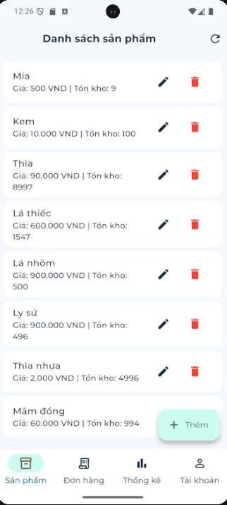
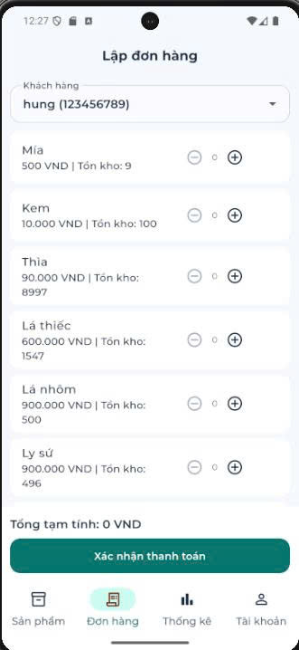
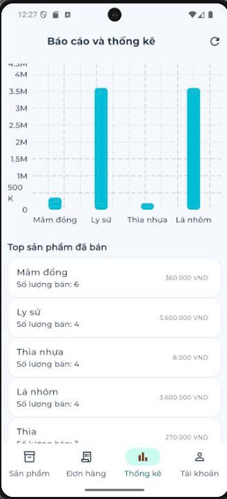

# test_02
## Tài khoản test nhanh

- Tài khoản (SĐT): `0901234567`
- Mật khẩu: `123456`

(Đây là tài khoản demo để test nhanh.)

## Cấu hình Base URL (API)

Base URL hiện tại đang được khai báo tại:

- `lib/core/constants/api_constants.dart`

Bạn chỉ cần sửa giá trị `ApiConstants.baseUrl`:

```dart
class ApiConstants {
	static const String baseUrl = 'http://interview.geneat.pro/api/v1';
}
```

Các request mạng sẽ tự động dùng base URL này thông qua `Dio` trong:

- `lib/core/network/api_client.dart`

## Packages chính sử dụng

Các thư viện chính (trong `pubspec.yaml`):

- `flutter_bloc`: State management (BLoC)
- `dio`: HTTP client
- `intl`: Format tiền tệ/chuỗi theo locale
- `fl_chart`: Vẽ biểu đồ (thống kê)

Thư viện mặc định Flutter:

- `cupertino_icons`

Dev dependencies:

- `flutter_lints`

## Demo app

| | | |
|---|---|---|
|  |  |  |
|  |  |  |